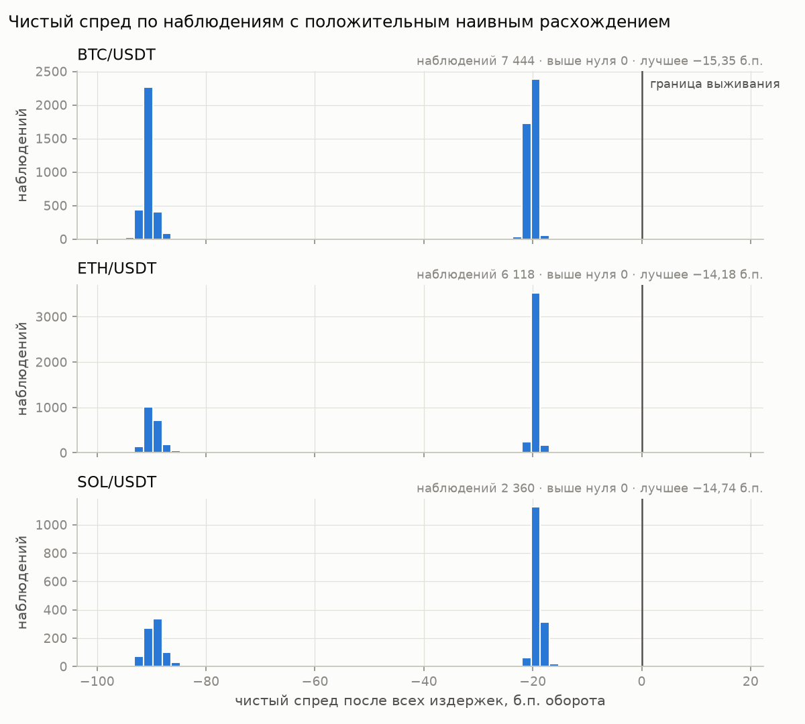
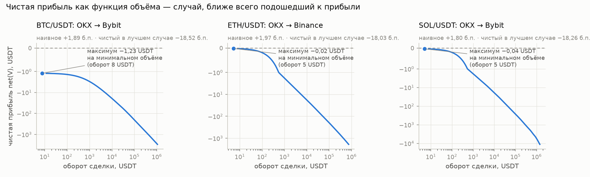

# crypto-arb-feasibility

Оценка выполнимости межбиржевого арбитража криптовалют: сколько ценовых
расхождений между биржами остаётся прибыльными после честного учёта всех издержек.

**Статус:** готово. Сбор данных — 3 часа 18 сентября 2026 года, результаты и выводы в разделе [Результаты](#результаты).

**Короткий ответ:** из 15 922 наблюдённых расхождений не выжило ни одно. Ограничивают комиссии: базовая комиссия двух сделок (20 б.п.) втрое больше самого широкого расхождения за три часа.

**Область:** только чтение публичных рыночных данных. Никаких API-ключей,
никакой торговли, никаких ордеров.

---

## Зачем

Расхождение цен между биржами видно невооружённым глазом: лучший бид на одной
площадке бывает выше лучшего аска на другой. На картинке это выглядит как
свободные деньги.

На практике между наблюдаемым расхождением и прибылью стоят пять слоёв издержек,
и каждый из них съедает часть спреда:

1. цена исполнения отличается от лучшей - объём проедает стакан;
2. комиссия тейкера на покупке и на продаже;
3. комиссия за вывод средств, зависящая от сети;
4. ограничения площадки: минимальный лот, шаг цены, минимальная сумма вывода;
5. время перевода - за него цена успевает уйти.

Проект отвечает на один вопрос: **какая доля наблюдаемых расхождений выживает
после всех пяти слоёв**, и при каком объёме сделки прибыль максимальна.

---

## Методика

### Шаг 1. Наивный спред

Точка отсчёта - то, что видно сразу:

```
naive_spread = (best_bid_B − best_ask_A) / best_ask_A
```

Все дальнейшие расчёты показывают, сколько от этого числа остаётся.

### Шаг 2. Реальная цена исполнения

Объём `V` не покупается по лучшей цене: он последовательно забирает уровни стакана.
Средневзвешенная цена исполнения на покупке

$$P_{\text{buy}}(V) = \frac{1}{V}\sum_i p_i \cdot q_i, \qquad \sum_i q_i = V,$$

где $(p_i, q_i)$ - уровни стороны ask по возрастанию цены. Симметрично для продажи
по стороне bid, по убыванию цены. Разница между $P_{\text{buy}}(V)$ и лучшей ценой -
проскальзывание; оно растёт с объёмом нелинейно.

### Шаг 3. Полные издержки

```
gross      = V · (P_sell(V) − P_buy(V))
fee_buy    = V · P_buy(V)  · taker_fee_A
fee_sell   = V · P_sell(V) · taker_fee_B
withdrawal = withdrawal_fee(coin, network) · P_sell(V)

net(V) = gross − fee_buy − fee_sell − withdrawal
```

Комиссии зависят от объёма торгов и уровня аккаунта; в конфигурации
зафиксирован базовый уровень с указанием источника и даты.

Дополнительно проверяются ограничения площадки: `V ≥ min_lot`,
цена кратна `tick_size`, сумма вывода не меньше минимальной.

### Шаг 4. Оптимальный объём

`gross` растёт с объёмом примерно линейно, проскальзывание - быстрее, комиссия
за вывод от объёма не зависит. Значит `net(V)` имеет максимум:

- при малых `V` фиксированная комиссия за вывод съедает всю прибыль;
- при больших `V` проскальзывание съедает спред.

Оптимум ищется численно по сетке объёмов с уточнением.

### Шаг 5. Риск времени перевода

Между покупкой на одной бирже и продажей на другой проходит время $\tau$ -
от единиц минут до получаса в зависимости от сети. За это время цена уходит.

Пусть $r_\tau$ - логарифмическая доходность актива за время $\tau$,
$\sigma_\tau$ - её стандартное отклонение, оценённое по историческим свечам.
Тогда возможность характеризуется не одним числом, а вероятностью

$$P\big(\text{net}(V) + V \cdot P_{\text{sell}} \cdot r_\tau > 0\big).$$

То есть вывод формулируется не как «плюс 0,4%», а как «плюс 0,4% с вероятностью
такой-то». Для оценки используется нормальное приближение с последующей проверкой
на эмпирическом распределении доходностей - хвосты у крипты тяжелее нормальных,
и нормальная оценка вероятности оптимистична.

---

## Данные

Публичные REST-эндпоинты, стаканы глубиной до 100 уровней:

| Биржа | Эндпоинт |
|---|---|
| Binance | `/api/v3/depth`, `/api/v3/exchangeInfo` |
| Bybit | `/v5/market/orderbook?category=spot` |
| OKX | `/api/v5/market/books` |
| Kraken | `/0/public/Depth` |

Пары: две высоколиквидные (`BTC/USDT`, `ETH/USDT`) и одна менее ликвидная -
`SOL/USDT`. Выбор проверен замером 17.09.2026: в полосе 5 б.п. от лучшей цены
по SOL стоит в 6–16 раз меньше объёма, чем по BTC, в зависимости от биржи.

Все четыре биржи доступны без ограничений по региону. Сбор идёт по прямому
подключению: через VPN задержки выбрасывались до 30 с при обычных 0,5 с,
что делает снимки разных бирж несопоставимыми
(`logs/endpoints_check_2026-09-17_*.txt`).

Комиссии, сети вывода и типичное время подтверждения вынесены в `config.yaml`
с указанием источника и даты фиксации.

---

## Что считается результатом

- **Коэффициент выживаемости** - доля наблюдённых наивных расхождений,
  остающихся прибыльными после всех издержек.
- **Распределение чистой прибыли** по выжившим возможностям: медиана, хвост, максимум.
- **Оптимальный объём** для каждой пары бирж и каждого инструмента.
- **Два графика:** `net(V)` как функция объёма и гистограмма чистого спреда.
- **Лог наблюдений** за несколько часов в csv - чтобы числа были воспроизводимы.
- **Абзац выводов**: что ограничивает сильнее - комиссии, глубина стакана
  или время перевода.

Ожидаемый ответ - что выживает малая доля. Это и есть содержательный результат:
он объясняет, почему арбитраж требует инфраструктуры, а не наблюдательности.

---

## Результаты

### Что собрано

| | |
|---|---|
| Период | 18.09.2026, 14:03–17:05 UTC, 3 часа |
| Снимков | 1 414 (4 биржи × 3 инструмента, параллельно) |
| Наблюдений | 51 444 (маршрут «купить на A → перевести → продать на B» в момент снимка) |
| Годных | 46 332 — 90,1 % |
| Брак: биржа не ответила | 4 968 — 9,7 %, почти целиком Kraken (не ответил в 19,3 % снимков; OKX — в 2 из 4 242) |
| Брак: снимки разъехались > 1 с | 144 — 0,3 % |

Лог: `logs/observations.csv`, стаканы раз в 5 минут: `logs/books.jsonl`.

### Коэффициент выживаемости

**0 из 15 922** наблюдений с положительным наивным расхождением.

Ноль наблюдений — не ноль вероятности. По правилу трёх верхняя 95-процентная
граница доли — 3/n. Если считать наблюдения независимыми, это 0,019 %. Но маршруты
внутри одного снимка зависимы, и честнее считать по снимкам: 3/1 413 ≈ **0,21 %**.
Граница относится к этим трём часам; периоды новостей и ликвидаций сюда не попали.

### Расхождения и что от них остаётся, б.п.

| | наблюдений | наивное: медиана | p95 | максимум | чистый: медиана | лучший |
|---|---|---|---|---|---|---|
| BTC/USDT | 7 444 | 0,60 | 2,10 | 7,89 | −21,04 | −15,35 |
| ETH/USDT | 6 118 | 0,55 | 2,46 | 20,46 | −19,94 | −14,18 |
| SOL/USDT | 2 360 | 0,91 | 3,61 | 18,82 | −19,53 | −14,74 |

Чистый спред считается в объёме, максимизирующем прибыль на единицу оборота.



Распределение двугорбое, и оба горба — это комиссии: около −20 б.п. маршруты без
Kraken (тейкер 0,1 % + 0,1 %), около −90 — через Kraken (0,1 % + 0,8 %).

### Что съедает расхождение

Медианы по наблюдениям с положительным наивным расхождением, б.п. оборота.
Тождество `итог = наивное − глубина − комиссии − вывод` выполняется точно.
«Перевод» — сколько надо заработать сверх нуля, чтобы пережить перевод
с вероятностью 0,9; это запас, а не затрата, но в тех же единицах.

| | | наивное | глубина | комиссии | вывод | перевод | итог | лучший |
|---|---|---|---|---|---|---|---|---|
| без Kraken | BTC | 0,58 | 0,18 | 20,00 | 0,48 | 23,21 | −20,19 | −15,35 |
| | ETH | 0,50 | 0,00 | 20,00 | 0,07 | 5,87 | −19,66 | −14,18 |
| | SOL | 0,91 | 0,00 | 20,00 | 0,23 | 11,03 | −19,25 | −14,74 |
| с Kraken | BTC | 0,63 | 0,67 | 90,00 | 0,59 | 40,06 | −90,64 | −83,57 |
| | ETH | 0,70 | 0,03 | 90,00 | 0,29 | 9,23 | −89,85 | −71,41 |
| | SOL | 0,92 | 0,35 | 90,00 | 0,54 | 11,03 | −89,44 | −73,08 |

### Оптимальный объём



Внутреннего оптимума, который ожидает методика (шаг 4), на этих данных нет:
`net(V)` убывает монотонно, и максимум стоит на минимальном допустимом объёме —
в показанных случаях 5–8 USDT оборота. Это прямое следствие того, что прибыли нет ни при каком объёме:
на малых объёмах теряется плата за вывод, на больших к ней добавляются комиссии
и проскальзывание. Оптимум в смысле README существует только у прибыльного
маршрута. Механизм поиска проверен на синтетическом стакане, где оптимум
считается руками (`tests/test_arbitrage.py`).

### Выводы

**Ограничивают комиссии, и с большим запасом.** Базовая комиссия тейкера
0,1 % на каждой стороне — это 20 б.п. на сделку. Самое широкое расхождение без
Kraken за три часа — 6,55 б.п., втрое меньше; медианное — 0,66 б.п., в 30 раз
меньше. Одних комиссий хватает, чтобы не выжило ни одно наблюдение, даже если
все остальные слои обнулить.

**Глубина стакана почти ни на что не влияет** — вопреки ожиданию, что контраст
ликвидной и менее ликвидной пары станет основным результатом. Контраст есть:
в полосе 5 б.п. от лучшей цены по SOL стоит в 6–16 раз меньше объёма, чем по BTC.
Но объёмы, на которых арбитраж вообще мог бы окупиться, малы, и стакан на них
проскальзывания почти не даёт: медиана 0–0,7 б.п.

**Время перевода — второй по силе слой и главный для биткоина.** Чтобы
перевод BTC пережил сделку с шансом 0,9, нужно 23 б.п. запаса при переводе
за 10 минут и 40 б.п. за 30 минут — больше, чем комиссии. Быстрые сети почти
бесплатны: ETH через Arbitrum за 30 секунд требует 5,9 б.п.

**Самые широкие расхождения — ловушка.** 96 из 100 самых широких расхождений
идут через Kraken: у него разреженный стакан. Но у Kraken и комиссия тейкера
0,8 %, и эти случаи оказываются от прибыли дальше всех: лучшие из них дают от −71
до −84 б.п. против −14…−15 у лучших маршрутов без него. Наивное расхождение до 20,46 б.п. выглядело
бы «выше комиссий», если не знать, через какую биржу оно идёт.

**Количественная форма тезиса «арбитраж требует инфраструктуры».** Чтобы выжило
хотя бы одно наблюдение без Kraken, суммарная комиссия двух сделок должна быть
ниже 5,83 б.п. — примерно 0,03 % на сторону. Это втрое ниже базового тарифа
любой из четырёх бирж. Даже при такой ставке прибыль была бы порядка единиц
базисных пунктов и ещё зависела бы от риска перевода.

**Уточнение к методике про тяжёлые хвосты.** Нормальное приближение завышает
шанс пережить перевод, но только далеко в хвосте: на пороге −3σ — на 0,22–0,55
процентного пункта по каждому инструменту и горизонту (избыточный куртозис
доходностей от 4 до 47). Около −2σ всё наоборот: распределение с тяжёлыми хвостами
острее в центре, и там нормальная оценка пессимистична.

---

## Как воспроизвести

```bash
python3 -m venv .venv && .venv/bin/pip install -r requirements.txt
.venv/bin/python -m pytest -q                     # 149 тестов
.venv/bin/python -u tools/validate_config.py      # сверка конфига с биржами
.venv/bin/python -u scan.py --minutes 180         # сбор, VPN выключен
.venv/bin/python -u analyze.py                    # отчёт и графики
```

`analyze.py` на закоммиченном логе и свечах воспроизводит все числа раздела
«Результаты», кроме сравнения глубины BTC и SOL: оно из протокола проверки
доступности `logs/endpoints_check_2026-09-17_no-vpn.txt`. Вывод анализатора
для этого лога сохранён в `reports/analyze_report.txt`.

---

## Структура

```
crypto-arb-feasibility/
  README.md
  config.yaml          биржи, пары, комиссии, сети (источник и дата)
  requirements.txt
  fetchers/            по модулю на биржу, общий интерфейс -> OrderBook
  core/
    config.py          загрузка config.yaml
    orderbook.py       нормализованный стакан, цена исполнения объёма
    costs.py           комиссии, вывод, лоты, шаг цены
    arbitrage.py       чистая прибыль, поиск оптимального объёма
    risk.py            волатильность за время перевода, P(прибыль > 0)
  scan.py              цикл сбора и записи лога
  analyze.py           агрегаты и графики
  tests/               юнит-тесты; fixtures/ - настоящие ответы бирж
  tools/               проверка доступности, выгрузка правил и комиссий,
                       время блока, сверка часов, свечи, валидатор конфига
  data/                комиссии с источниками; свечи для риска перевода
  logs/                лог наблюдений, стаканы, протоколы проверок
  reports/             графики
```

Стек: Python 3.14, `requests`, `PyYAML`, `ruamel.yaml`, `matplotlib`, `pytest`.
`pandas`, `numpy` и `scipy` из исходного плана не понадобились: агрегаты считаются
на стандартной библиотеке, функция нормального распределения — через `math.erf`.

---

## Известные ограничения

**Несинхронность снимков.** Стаканы разных бирж снимаются не одновременно;
расхождение в секунду уже порождает ложные сигналы. Введён допуск по времени,
наблюдения с превышением отбраковываются.

**Ограниченная глубина.** Доступно до 100 уровней; для объёмов, выходящих
за пределы видимой части стакана, расчёт даёт оценку сверху по прибыли.

**Комиссии не универсальны.** Зависят от уровня аккаунта и объёма торгов.
Зафиксирован базовый уровень; результаты для крупного участника будут лучше.

**Лимиты запросов.** Частота ограничена биржами, сбор идёт с троттлингом,
поэтому шаг наблюдений - секунды, а не миллисекунды. Быстрые возможности
в такую сетку не попадают.

**Доступность площадок.** Часть бирж может быть недоступна из отдельных регионов;
фактически использованный состав фиксируется в логе.

**Модель времени перевода** упрощена: берётся типичное время подтверждения сети
без учёта очереди и загрузки сети в момент операции.

**Три часа одного дня.** Выборка — 18.09.2026, 14:03–17:05 UTC. Всплески,
связанные с новостями и каскадными ликвидациями, в неё не попали, и граница
0,21 % относится к обычному рынку.

**Kraken представлен хуже остальных.** Он не ответил в 19,3 % снимков,
против двух отказов OKX за весь прогон. На выводы это не влияет — маршруты через
Kraken дальше всех от прибыли, — но выборка по ним меньше.

**Источники комиссий.** 33 из 51 значения комиссий и параметров вывода взяты
из вторичной сводки по страницам бирж: ни одна биржа не отдаёт их без API-ключа.
Из первых рук — правила инструментов (публичный API), всё по Binance (публичный
эндпоинт) и тейкер Kraken (страница тарифов). Каждое значение помечено в
`config.yaml`. Для вывода важна прежде всего комиссия тейкера: у Binance 0,1 %
подтверждено из первых рук, у Bybit и OKX — по сводке, а лучшее наблюдение
пришлось как раз на пару Bybit → OKX. Чтобы там выжило хоть что-то, сумма двух
комиссий должна быть ниже 5,83 б.п. вместо 20 — то есть сводка должна ошибаться
больше чем втрое.

**Риск перевода определён не для всех маршрутов.** Нет числа подтверждений у OKX
по всем сетям и у Kraken по Arbitrum и Solana: для 6 из 16 направлений риск
«не определён», а не нулевой. Волатильность оценена по свечам Binance для всех
бирж; горизонт 0,32 с (Solana) короче секундной свечи, и для него σ — оценка
сверху.

**Часы.** Локальные часы отставали от биржевых на 0,7–0,9 с. Разброс снимков
поэтому считается только по локальным меткам, где сдвиг сокращается
(`logs/clock_check_2026-09-18.txt`).

**Перевод в одну сторону.** Модель учитывает один перевод монеты. Чтобы
повторять сделку, средства рано или поздно придётся вернуть на первую биржу,
и эта плата не учтена — оценка прибыли тем самым завышена, и вывод от этого
только сильнее.
